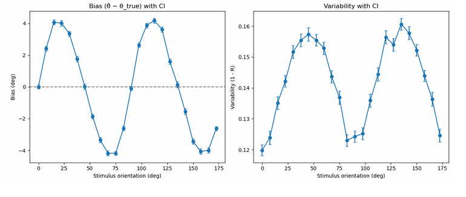
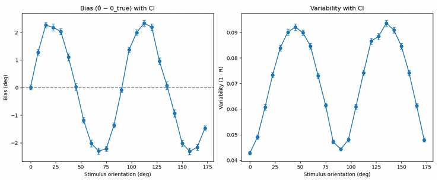
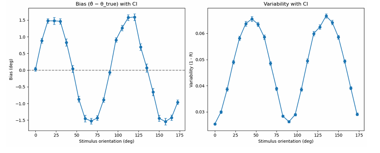
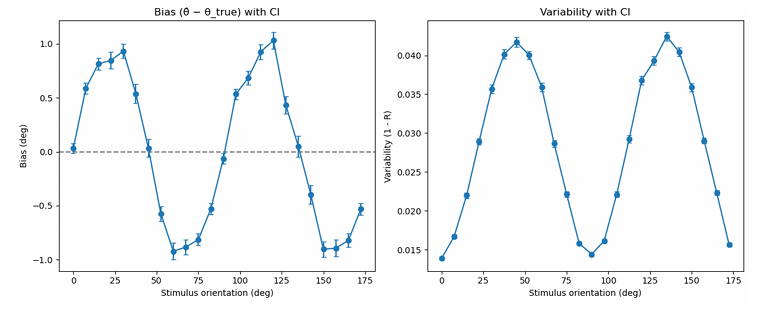

# Bayesian Perceptual Estimation

This project implements a Bayesian observer model for perceptual estimation, developed during a research internship focused on computational modeling.

---

## 🎯 Objective
- Investigate orientation-specific perceptual bias and variability  
- Reproduce key behavioral phenomena:
  - Repulsive bias (away from cardinal orientations)  
  - Oblique effect (increased variability at oblique orientations)  

---

## 📐 Bayesian Observer Model

The observer estimates stimulus orientation based on noisy sensory measurements.

### Likelihood

Sensory measurements are assumed to follow a Gaussian distribution:

$$
p(m|\theta) = \mathcal{N}(m; \theta, \sigma^2)
$$

where \( \theta \) is the true stimulus orientation and \( \sigma \) represents sensory noise.

---

### Prior

A prior distribution over orientations is assumed:

$$
p(\theta)
$$

This prior captures the observer’s expectation about stimulus statistics (e.g., bias toward cardinal orientations).

---

### Posterior

Using Bayes’ rule:

$$
p(\theta|m) \propto p(m|\theta)p(\theta)
$$

The posterior combines sensory evidence with prior knowledge.

---

### Estimation

The perceptual estimate is computed as the posterior mean:

$$
\hat{\theta} = \mathbb{E}[\theta \mid m]
$$

---

## 📊 Fisher Information

Fisher information quantifies how much information the measurement carries about the stimulus.

$$
J(\theta) = \int \left( \frac{\partial}{\partial \theta} \log p(m|\theta) \right)^2 p(m|\theta) \, dm
$$

For Gaussian likelihood:

$$
J(\theta) = \frac{1}{\sigma^2}
$$

---

## 🛠 Methods
- Bayesian inference with prior and likelihood distributions  
- Circular statistics for modeling orientation space  
- Simulation of perceptual estimation under noise  

---

## 🔬 Simulation
- 24 evenly spaced orientation stimuli (7.5° intervals)  
- Repeated sampling for each stimulus  
- Bias and variability curves computed across orientations  
- Multiple simulations performed to examine stability  

---

## 📈 Results

We examined how perceptual bias and variability change as a function of the concentration parameter (κ).

As κ increases, prior concentration strengthens, leading to increased bias and reduced variability.

---

### κ = 4 (relatively weak prior)

Bias is relatively weak, and variability remains high.

---

### κ = 8 (moderate prior)

Bias begins to emerge near cardinal orientations, while variability starts to decrease.

---

### κ = 12 (strong prior)

Repulsive bias becomes more pronounced, and variability is further reduced.

---

### κ = 20 (very strong prior)

Strong prior influence leads to clear repulsive bias and low variability.

---

*Figure: Bias and variability as a function of stimulus orientation for different values of κ.*

---

## 📝 Notes
- Inspired by Wei & Stocker (2015)  
- Implemented in Python using `numpy` and `matplotlib`  
- Focus on conceptual modeling and simulation rather than full experimental pipeline  
